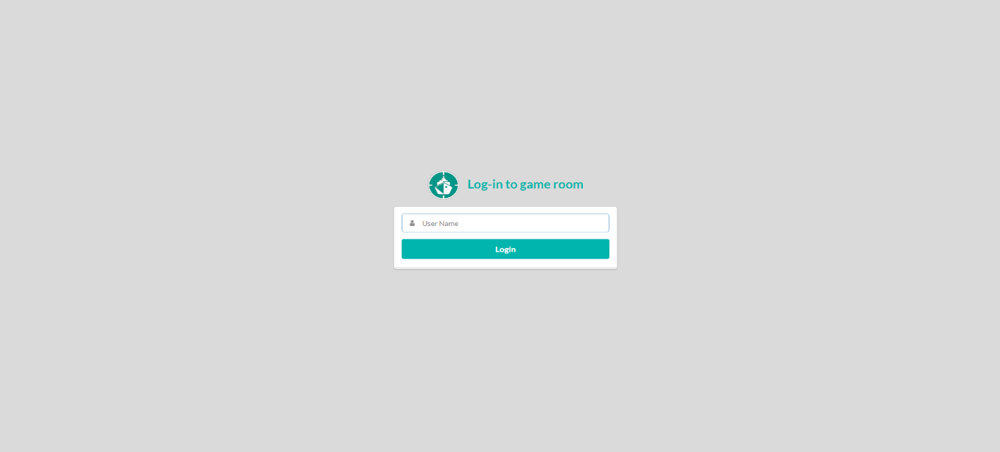
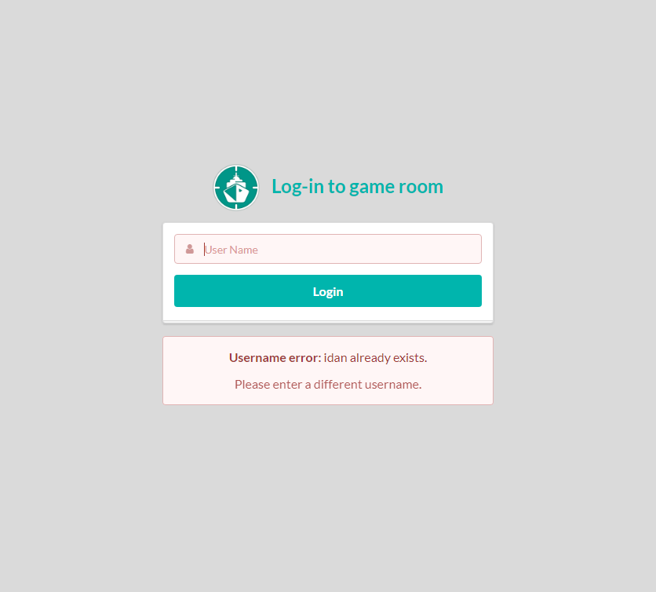
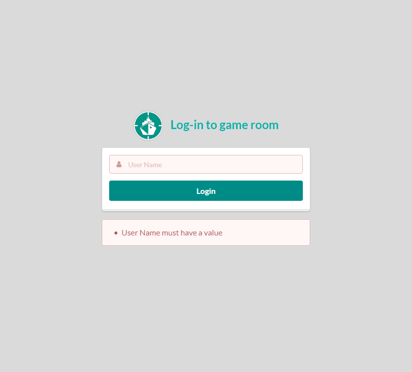
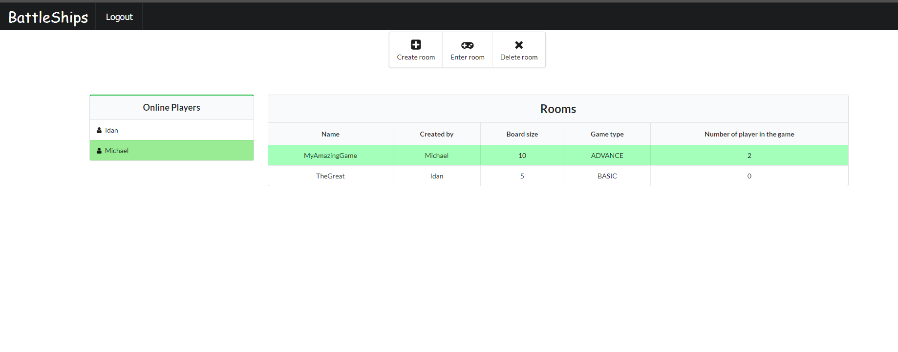
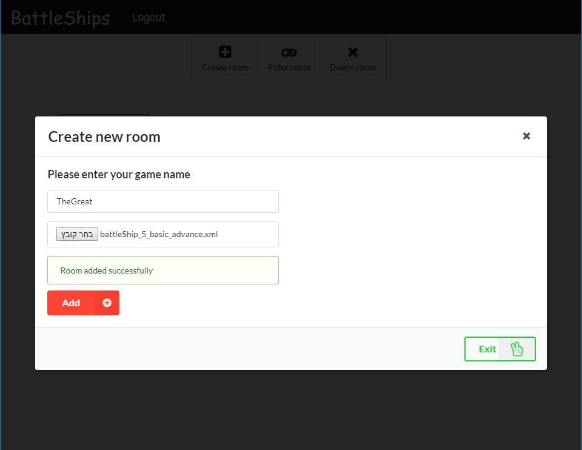
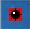
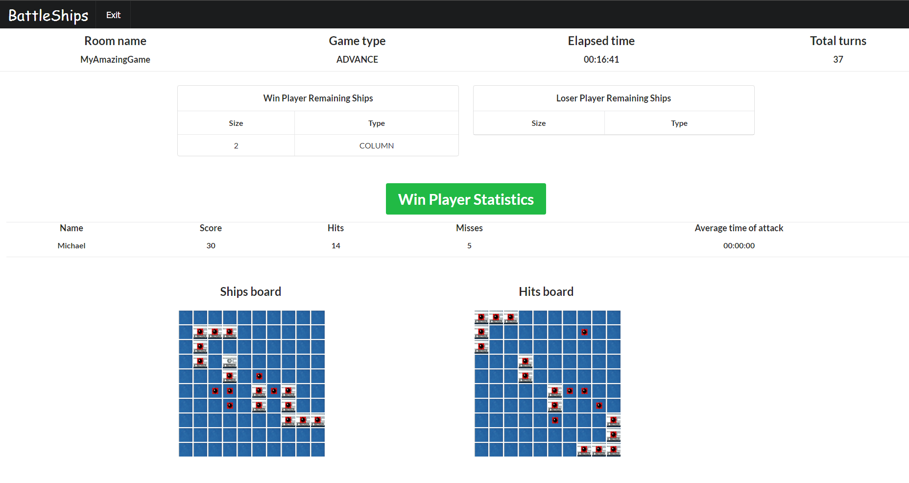
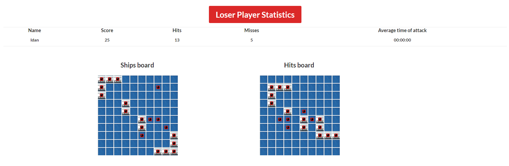

# Battleship-Game
A Web-Based-Multiplayer Battleship game in HTML/JavaScript, with Client-Server coordination. 
Server side code was written in Java using Tomcat server.

## Project demonstration
 ###  Login screen :
- #### Can't login with same username that already login to the system.
- #### Can't login with empty username.

- #### If the user exceeds the rules, a corresponding error message is displayed.

 ###  Rooms screen:
  1. In this screen display all the online users, when the line of the user himself marked in green.
  2. Can be see all the avilabel rooms.  
  In case the room is marked in light green it's mean that this room is full, and the user can't login.
  3. Player can upload new game by click on **Create room** button.  
  In case the upload game does not meet the rules, a orresponding error message is displayed that explain the problem.
  4. In order to enter to room, need to choose one room from the rooms table, the line will marked in grey and then click on **Enter room** button, if the room is not full the user will move to the game page.

#### Room screen example.

### Game screen:
 1. The game automatic began when all the players connect to the game.
 2. There is a message box in the center of the screen that show to the user messages about the game staus.
 - #### The possible messages is:  
  a) Hit, Miss, Plant of mines. 
  b) Who the active player now. 
  c) Server communication error. 
  d) Lose or Win message.
  
#### Game screen example.

 
 ### Board marks:
  1. empty square : 
  2. ship square : 
  3. miss square : 
  4. hit square : 
  5. mine hit square : 
  6. mine square : 
  
 ### Summary screen:
 This screen display when the game is finish.
  
#### Summary screen example.

 **can run the project with the Ex3_war.war file using Tomcat.**
